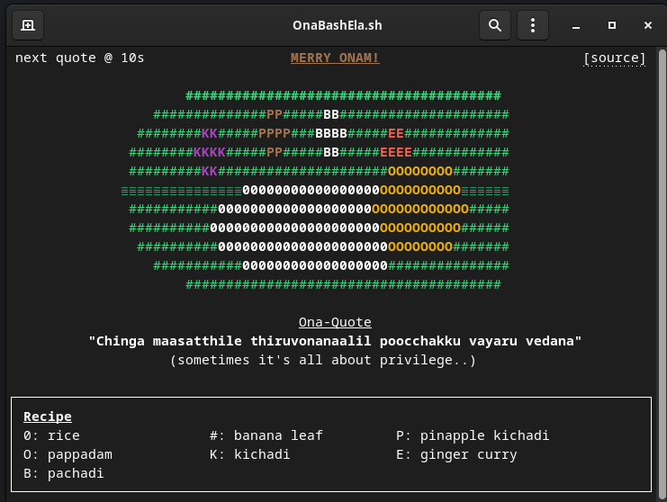

# OnaBashEla.sh

A simple bash script to wish you a happy Onam. By the way, Onam is a festival from Kerala, in case this script is being read by any non-Keralite.




## Usage

**1. Using `curl`**
```sh
curl https://raw.githubusercontent.com/bruttazz/OnaBashEla.sh/main/ona-bash-ela.sh | bash
```

**2. For `wget` lovers**
```sh
wget -qO- https://raw.githubusercontent.com/bruttazz/OnaBashEla.sh/main/ona-bash-ela.sh | bash
```
**3. One can simply download the script, make it executable and run**


**4. For the 'postmodern' fellows, there's also a container on Docker Hub**
```sh
docker run --pull missing  -it --rm bruttazz/ona-bash-ela:1.0.0
```


## Advanced Usage
The script has some additional options. Try running it with the `--help` flag.
